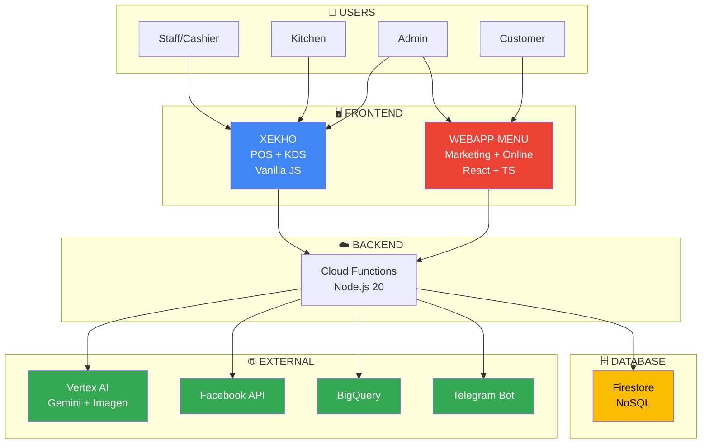

# 🏗️ XE KHÔ CHỮA LÀNH - ARCHITECTURE SUMMARY
## Executive Overview (1-Page)

**Version:** 1.0 | **Date:** 17/05/2026 | **Status:** 🟢 Production

---

## 📊 SYSTEM OVERVIEW



---

## 🎯 KEY FEATURES

### **XEKHO (POS System)**
- ✅ Point of Sale với table management
- ✅ Kitchen Display System (realtime)
- ✅ AI Chatbot (Voice + Text, Gemini 2.5)
- ✅ Inventory Management
- ✅ Telegram notifications

### **WEBAPP-MENU (Marketing Platform)**
- ✅ Chief of Staff Dashboard (AI-powered insights)
- ✅ Marketing AI (Auto content generation)
- ✅ Online Ordering (Customer-facing)
- ✅ Facebook Ads Management
- ✅ BigQuery Analytics

---

## 🔄 CORE WORKFLOWS

### **1. Order Flow**
```
Customer → Online Order → POS Approval → Kitchen → Ready → Payment → Complete
```

### **2. Marketing Flow**
```
AI Brief (9AM) → Admin Review → Generate Content → Publish Facebook → Track Performance
```

### **3. Chief Flow**
```
Daily Analysis (9AM) → Calculate Score → Generate Insights → Set Goals → Action Plan
```

---

## 💾 DATA ARCHITECTURE

### **Shared Collections** (Firestore)
- `public_menu` - Menu công khai
- `order_requests` - Đơn online
- `history` - Lịch sử đơn hàng
- `Product_Catalog` - Danh mục sản phẩm

### **XEKHO Collections**
- `Inventory_Items` - Quản lý kho
- `purchases` - Nhập hàng
- `kitchen_notifications` - Thông báo bếp

### **WEBAPP-MENU Collections**
- `director_briefs` - Marketing briefs
- `marketing_actions` - Content posts
- `executive_daily_briefs` - Chief reports

---

## 🤖 AI INTEGRATION

| Service | Model | Use Case | Cost |
|---------|-------|----------|------|
| Vertex AI | Gemini 2.5 Pro | Complex reasoning, Chief analysis | $7/1M tokens |
| Vertex AI | Gemini 2.5 Flash | Quick responses, content gen | $0.075/1M tokens |
| Vertex AI | Imagen 4.0 | Image generation | $0.04/image |

**Key AI Features:**
- 🗣️ Voice-to-text chatbot
- 📝 Auto marketing content generation
- 🖼️ AI-generated menu images
- 📊 Business insights & recommendations
- 🎯 Goal-based action planning

---

## 📈 TECH STACK

| Layer | Technology | Purpose |
|-------|-----------|---------|
| **Frontend** | Vanilla JS + React 18 + TS | UI/UX |
| **Backend** | Firebase Cloud Functions v2 | Serverless API |
| **Database** | Firestore + Realtime DB | NoSQL + Presence |
| **Auth** | Firebase Authentication | User management |
| **Storage** | Firebase Storage | Images, videos |
| **Hosting** | Firebase Hosting | Static sites |
| **AI/ML** | Vertex AI (Gemini, Imagen) | Intelligence |
| **Analytics** | BigQuery | Data warehouse |
| **Notifications** | Telegram Bot + FCM | Alerts |

---

## 🚀 DEPLOYMENT

### **Environments:**
- **Production**: `xekho.web.app` + `webapp-menu.web.app`
- **Region**: `asia-southeast1`
- **Firebase Project**: `pos-v2-909ff`

### **CI/CD:**
```bash
# Deploy XEKHO
firebase deploy --only hosting,functions

# Deploy WEBAPP-MENU
npm run build && firebase deploy
```

---

## 📊 METRICS & MONITORING

### **Current Status:**
- ✅ **POS Core**: 95% complete
- 🟡 **Chief of Staff**: 70-75% complete
- 🟡 **Marketing AI**: 85% complete
- ✅ **Backend**: 90% complete
- 🟡 **Testing**: 60% complete

### **Performance Targets:**
- ⚡ Load time: < 2s
- 📊 Lighthouse score: > 90
- 🧪 Test coverage: 80%
- 💰 AI cost optimization: -30%

---

## 🔐 SECURITY

- ✅ Firebase Authentication (Email/Password)
- ✅ Firestore Security Rules (role-based)
- ✅ HTTPS only (Firebase Hosting)
- ✅ API keys in Secret Manager
- ⏳ Rate limiting (planned)
- ⏳ Input validation (in progress)

---

## 🎯 NEXT STEPS

### **Phase 1: Quick Wins** (Week 1-2)
1. Rút gọn báo cáo Marketing
2. Facebook Sync implementation
3. Weather API integration

### **Phase 2: Features** (Week 3-4)
1. BigQuery analytics
2. Mobile UI polish
3. Real-time updates

### **Phase 3: Polish** (Week 5-6)
1. Unit tests (80% coverage)
2. E2E tests
3. Performance optimization
4. Security audit

---

## 📚 DOCUMENTATION

- 📖 [SYSTEM_ARCHITECTURE.md](./SYSTEM_ARCHITECTURE.md) - Full technical documentation
- 🗺️ [ROADMAP.md](./ROADMAP.md) - Development roadmap
- 📋 [IMPLEMENTATION.md](./IMPLEMENTATION.md) - Implementation guide
- 🧪 [TESTING_CHECKLIST.md](./TESTING_CHECKLIST.md) - Testing guide
- 🚀 [DEPLOYMENT_GUIDE.md](./DEPLOYMENT_GUIDE.md) - Deployment instructions

---

## 💡 KEY INSIGHTS

### **Strengths:**
- ✅ Serverless architecture (cost-effective, auto-scaling)
- ✅ AI-powered (Gemini 2.5 Pro/Flash, Imagen 4.0)
- ✅ Realtime updates (Firestore listeners)
- ✅ Comprehensive (POS + Marketing + Analytics)
- ✅ Multi-platform (Web, Mobile, Desktop)

### **Challenges:**
- ⏳ Testing coverage (0% → 80%)
- ⏳ Mobile UI consistency
- ⏳ Performance optimization
- ⏳ Security hardening

### **Opportunities:**
- 🚀 Expand to multi-restaurant
- 🚀 Mobile apps (iOS, Android)
- 🚀 Advanced analytics (ML predictions)
- 🚀 Integration with delivery platforms

---

## 📞 CONTACT & SUPPORT

**Development Team**  
**Project:** Xe Khô Chữa Lành  
**Firebase Project:** pos-v2-909ff  
**Last Updated:** 17/05/2026

---

**🎯 For detailed technical documentation, see [SYSTEM_ARCHITECTURE.md](./SYSTEM_ARCHITECTURE.md)**
