# 🏗️ KIẾN TRÚC HỆ THỐNG XE KHÔ CHỮA LÀNH
## POS & Kitchen Display + Marketing AI Platform

**Version:** 1.0  
**Date:** 17/05/2026  
**Author:** Development Team  
**Status:** 🟢 Production

---

## 📋 MỤC LỤC

1. [Tổng quan](#1-tổng-quan)
2. [Sơ đồ Kiến trúc Tổng thể](#2-sơ-đồ-kiến-trúc-tổng-thể)
3. [Sơ đồ Luồng Dữ liệu](#3-sơ-đồ-luồng-dữ-liệu)
4. [Sơ đồ Hành trình Người dùng](#4-sơ-đồ-hành-trình-người-dùng)
5. [Sơ đồ Điểm Tích hợp](#5-sơ-đồ-điểm-tích-hợp)
6. [Chi tiết Components](#6-chi-tiết-components)
7. [Database Schema](#7-database-schema)
8. [API Endpoints](#8-api-endpoints)
9. [External Services](#9-external-services)
10. [Deployment Architecture](#10-deployment-architecture)

---

## 1. TỔNG QUAN

### 1.1 Giới thiệu

**Xe Khô Chữa Lành** là hệ thống quản lý quán ăn toàn diện, bao gồm:
- 🍽️ **POS System** - Quản lý bán hàng tại quán
- 👨‍🍳 **Kitchen Display System** - Màn hình bếp realtime
- 🤖 **AI Chatbot** - Trợ lý ảo thông minh (Voice + Text)
- 📊 **Chief of Staff** - Dashboard tổng quan cho chủ quán
- 🎨 **Marketing AI** - Tự động tạo content marketing
- 🛒 **Online Ordering** - Đặt món online cho khách hàng

### 1.2 Tech Stack

#### **Frontend:**
- **XEKHO**: Vanilla JavaScript (ES6+), HTML5, CSS3
- **WEBAPP-MENU**: React 18 + TypeScript, Tailwind CSS, Vite

#### **Backend:**
- **Firebase Cloud Functions v2** (Node.js 20)
- **Firebase Firestore** (NoSQL Database)
- **Firebase Realtime Database** (Presence tracking)
- **Firebase Authentication** (Email/Password + Custom tokens)
- **Firebase Storage** (Images, receipts)
- **Firebase Hosting** (Static hosting)

#### **AI/ML:**
- **Vertex AI** (Google Cloud)
  - Gemini 2.5 Pro (Complex reasoning)
  - Gemini 2.5 Flash (Fast responses)
  - Imagen 4.0 (Image generation)
- **DeepSeek** (Optional fallback)

#### **External APIs:**
- **Facebook Graph API** (Page metrics, Ads management)
- **OpenWeatherMap API** (Weather data)
- **BigQuery** (Analytics, data warehouse)
- **Telegram Bot API** (Notifications)
- **FFmpeg** (Video rendering)

### 1.3 Key Features

| Feature | XEKHO | WEBAPP-MENU |
|---------|-------|-------------|
| POS System | ✅ | ❌ |
| Kitchen Display | ✅ | ❌ |
| AI Chatbot | ✅ | ❌ |
| Inventory Management | ✅ | ❌ |
| Chief of Staff Dashboard | ❌ | ✅ |
| Marketing AI | ❌ | ✅ |
| Online Ordering | ❌ | ✅ |
| Facebook Ads Management | ❌ | ✅ |
| Telegram Integration | ✅ | ✅ |

---

## 2. SƠ ĐỒ KIẾN TRÚC TỔNG THỂ

### 2.1 High-Level Architecture

```mermaid
graph TB
    subgraph "👥 USERS & CLIENTS"
        U1[👨‍💼 Staff/Cashier<br/>Thu ngân]
        U2[👨‍🍳 Kitchen Staff<br/>Nhân viên bếp]
        U3[👨‍💻 Admin<br/>Quản lý]
        U4[🛒 Customer<br/>Khách hàng]
    end
    
    subgraph "🖥️ FRONTEND LAYER"
        subgraph "XEKHO - Vanilla JS"
            F1[📱 POS UI<br/>Giao diện bán hàng]
            F2[👨‍🍳 Kitchen Display<br/>Màn hình bếp]
            F3[🤖 AI Chatbot<br/>Voice + Text]
        end
        
        subgraph "WEBAPP-MENU - React + TS"
            F4[📊 Chief of Staff<br/>Dashboard tổng quan]
            F5[🎨 Marketing AI<br/>Content generation]
            F6[🛒 Online Ordering<br/>Đặt món online]
        end
    end
    
    subgraph "☁️ BACKEND LAYER - Firebase Cloud Functions"
        subgraph "XEKHO Functions"
            B1[⚡ aiRouter<br/>AI request handler]
            B2[📄 purchaseOcr<br/>OCR hóa đơn]
            B3[📧 telegramWebhook<br/>Telegram bot]
            B4[📊 scheduledReport<br/>Báo cáo tự động]
        end
        
        subgraph "WEBAPP-MENU Functions"
            B5[👔 scheduledChiefOfStaff<br/>Chief analysis]
            B6[📝 scheduledDirectorBrief<br/>Marketing brief]
            B7[🎯 generateChiefTargetPlan<br/>Phương án từ mục tiêu]
            B8[🎬 renderVideoWithFFmpeg<br/>Video rendering]
        end
    end
    
    subgraph "🗄️ DATABASE LAYER - Firestore"
        DB1[(📦 Shared Collections<br/>public_menu, order_requests<br/>service_requests, history)]
        DB2[(🍽️ POS Collections<br/>Product_Catalog, Inventory<br/>purchases, kitchen_notifications)]
        DB3[(🎨 Marketing Collections<br/>director_briefs, marketing_actions<br/>executive_briefs, competitor_watch)]
    end
    
    subgraph "🌐 EXTERNAL SERVICES"
        E1[🤖 Vertex AI<br/>Gemini + Imagen]
        E2[📘 Facebook API<br/>Page + Ads]
        E3[🌤️ Weather API<br/>OpenWeatherMap]
        E4[📊 BigQuery<br/>Analytics]
        E5[📧 Telegram Bot<br/>Notifications]
        E6[🎬 FFmpeg<br/>Video processing]
    end
    
    %% User connections
    U1 --> F1
    U2 --> F2
    U3 --> F1
    U3 --> F4
    U3 --> F5
    U4 --> F6
    
    %% Frontend to Backend
    F1 --> B1
    F1 --> B2
    F2 --> B3
    F3 --> B1
    F4 --> B5
    F4 --> B7
    F5 --> B6
    F5 --> B8
    F6 --> B1
    
    %% Backend to Database
    B1 --> DB1
    B1 --> DB2
    B2 --> DB2
    B3 --> DB2
    B4 --> DB2
    B5 --> DB3
    B6 --> DB3
    B7 --> DB3
    B8 --> DB3
    
    %% Backend to External Services
    B1 --> E1
    B2 --> E1
    B5 --> E1
    B5 --> E2
    B5 --> E3
    B5 --> E4
    B6 --> E1
    B6 --> E2
    B6 --> E3
    B3 --> E5
    B4 --> E5
    B6 --> E5
    B8 --> E6
    
    %% Styling
    style F1 fill:#4285f4,stroke:#1a73e8,stroke-width:2px,color:#fff
    style F2 fill:#4285f4,stroke:#1a73e8,stroke-width:2px,color:#fff
    style F3 fill:#4285f4,stroke:#1a73e8,stroke-width:2px,color:#fff
    style F4 fill:#ea4335,stroke:#c5221f,stroke-width:2px,color:#fff
    style F5 fill:#ea4335,stroke:#c5221f,stroke-width:2px,color:#fff
    style F6 fill:#ea4335,stroke:#c5221f,stroke-width:2px,color:#fff
    style DB1 fill:#fbbc04,stroke:#f9ab00,stroke-width:2px,color:#000
    style DB2 fill:#fbbc04,stroke:#f9ab00,stroke-width:2px,color:#000
    style DB3 fill:#fbbc04,stroke:#f9ab00,stroke-width:2px,color:#000
    style E1 fill:#34a853,stroke:#1e8e3e,stroke-width:2px,color:#fff
    style E2 fill:#34a853,stroke:#1e8e3e,stroke-width:2px,color:#fff
    style E3 fill:#34a853,stroke:#1e8e3e,stroke-width:2px,color:#fff
    style E4 fill:#34a853,stroke:#1e8e3e,stroke-width:2px,color:#fff
    style E5 fill:#34a853,stroke:#1e8e3e,stroke-width:2px,color:#fff
    style E6 fill:#34a853,stroke:#1e8e3e,stroke-width:2px,color:#fff
```

### 2.2 Giải thích Kiến trúc

#### **Layer 1: Users & Clients**
- **Staff/Cashier**: Sử dụng POS để gọi món, thanh toán
- **Kitchen Staff**: Xem màn hình bếp, cập nhật trạng thái món
- **Admin**: Quản lý toàn bộ hệ thống (POS + Marketing)
- **Customer**: Đặt món online qua website

#### **Layer 2: Frontend**
- **XEKHO (Xanh)**: Vanilla JS, focus vào POS operations
- **WEBAPP-MENU (Đỏ)**: React + TS, focus vào Marketing & Online

#### **Layer 3: Backend**
- **Cloud Functions**: Serverless, auto-scaling
- **Separation**: Mỗi repo có functions riêng, share Firestore

#### **Layer 4: Database**
- **Shared Collections**: Dữ liệu chung giữa 2 apps
- **Dedicated Collections**: Dữ liệu riêng cho từng app

#### **Layer 5: External Services**
- **AI**: Vertex AI cho chatbot, content generation, image generation
- **APIs**: Facebook, Weather, BigQuery, Telegram
- **Processing**: FFmpeg cho video rendering

---

## 3. SƠ ĐỒ LUỒNG DỮ LIỆU

### 3.1 Order Flow (Luồng đơn hàng)

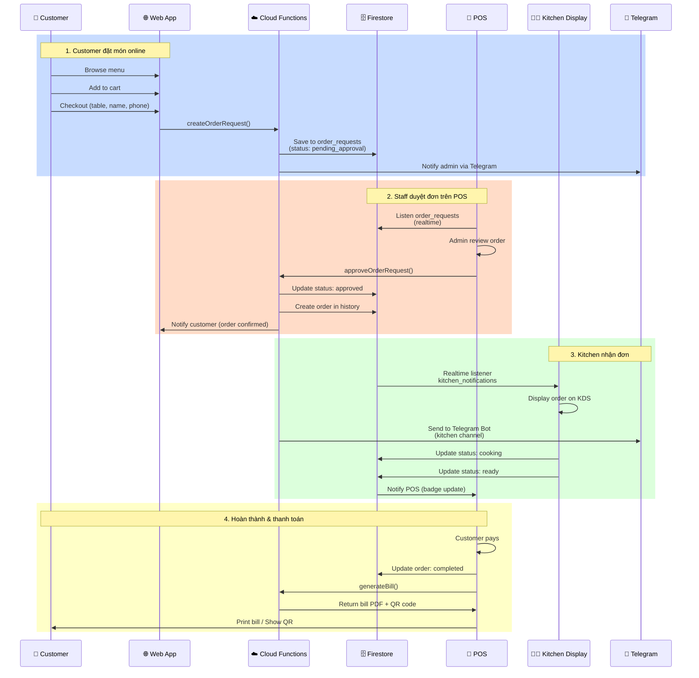

### 3.2 Marketing AI Flow (Luồng Marketing)

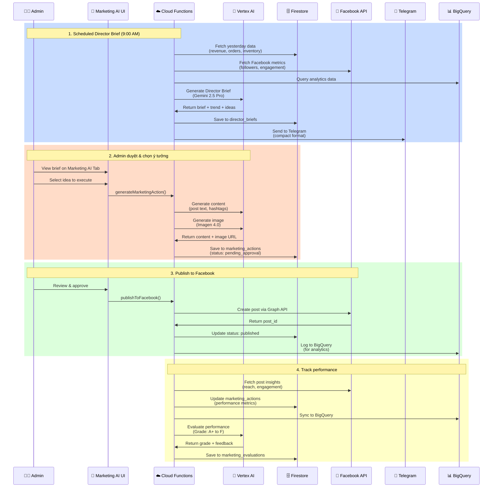

### 3.3 Chief of Staff Flow (Luồng Chief)

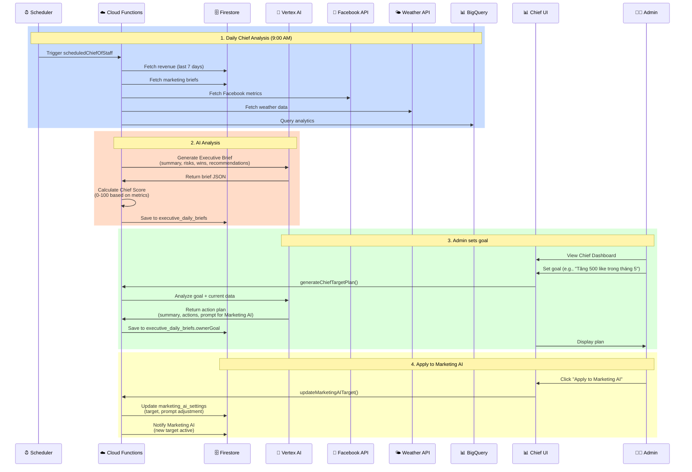

---

## 4. SƠ ĐỒ HÀNH TRÌNH NGƯỜI DÙNG

### 4.1 Staff/Cashier Journey

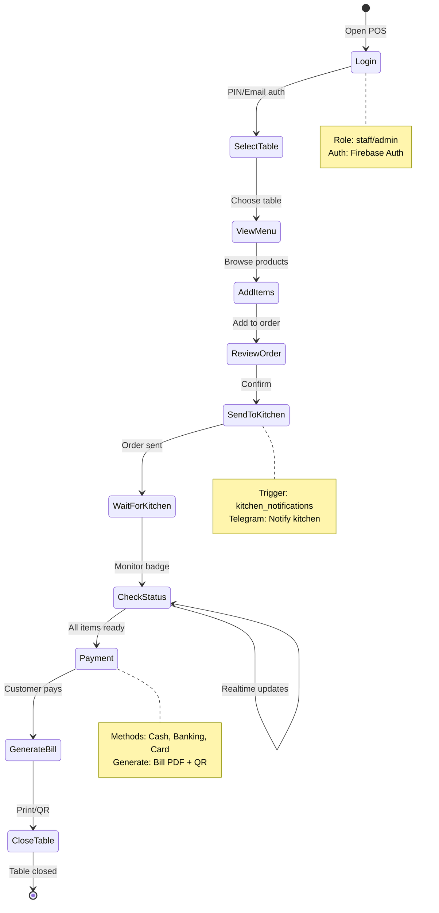

### 4.2 Kitchen Staff Journey

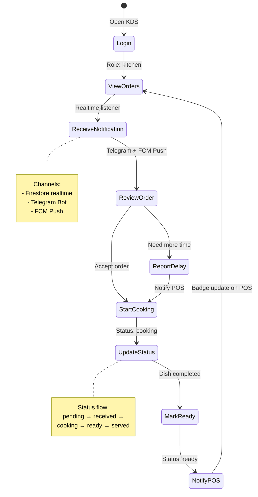

### 4.3 Admin Journey

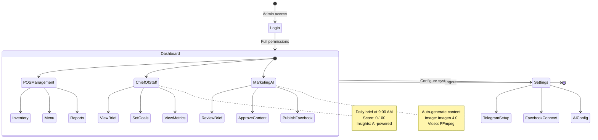

### 4.4 Customer Journey

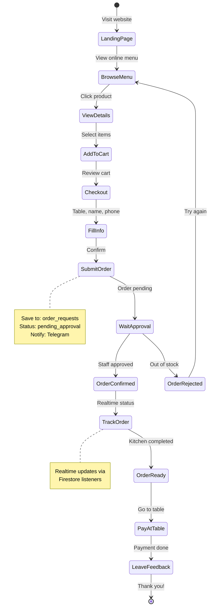

---

## 5. SƠ ĐỒ ĐIỂM TÍCH HỢP

### 5.1 Shared Firestore Collections

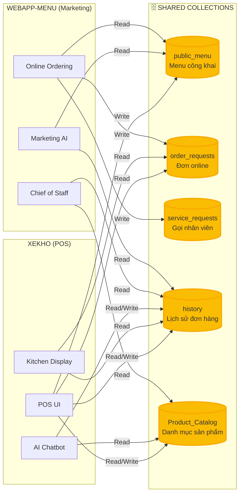

### 5.2 API Integration Points

```mermaid
graph TB
    subgraph "XEKHO Cloud Functions"
        XF1[aiRouter<br/>POST /aiRouter]
        XF2[purchaseOcr<br/>POST /purchaseOcr]
        XF3[telegramWebhook<br/>POST /telegramWebhook]
        XF4[scheduledReport<br/>CRON: */5 * * * *]
    end
    
    subgraph "WEBAPP-MENU Cloud Functions"
        WF1[scheduledChiefOfStaff<br/>CRON: 0 9 * * *]
        WF2[scheduledDirectorBrief<br/>CRON: 0 9 * * *]
        WF3[generateChiefTargetPlan<br/>POST /generateChiefTargetPlan]
        WF4[renderVideoWithFFmpeg<br/>POST /renderVideoWithFFmpeg]
        WF5[publishToFacebook<br/>POST /publishToFacebook]
    end
    
    subgraph "External APIs"
        E1[Vertex AI<br/>Gemini + Imagen]
        E2[Facebook Graph API<br/>v18.0]
        E3[OpenWeatherMap<br/>v2.5]
        E4[BigQuery<br/>pos-v2-909ff]
        E5[Telegram Bot API<br/>sendMessage]
    end
    
    XF1 --> E1
    XF2 --> E1
    XF3 --> E5
    XF4 --> E5
    
    WF1 --> E1
    WF1 --> E2
    WF1 --> E3
    WF1 --> E4
    WF2 --> E1
    WF2 --> E2
    WF2 --> E3
    WF2 --> E5
    WF3 --> E1
    WF4 --> E1
    WF5 --> E2
    
    style XF1 fill:#4285f4,color:#fff
    style XF2 fill:#4285f4,color:#fff
    style XF3 fill:#4285f4,color:#fff
    style XF4 fill:#4285f4,color:#fff
    style WF1 fill:#ea4335,color:#fff
    style WF2 fill:#ea4335,color:#fff
    style WF3 fill:#ea4335,color:#fff
    style WF4 fill:#ea4335,color:#fff
    style WF5 fill:#ea4335,color:#fff
```

---

## 6. CHI TIẾT COMPONENTS

### 6.1 XEKHO Components

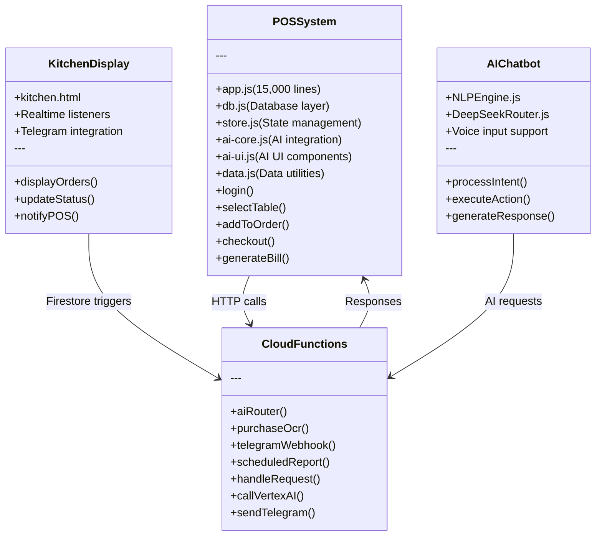

### 6.2 WEBAPP-MENU Components

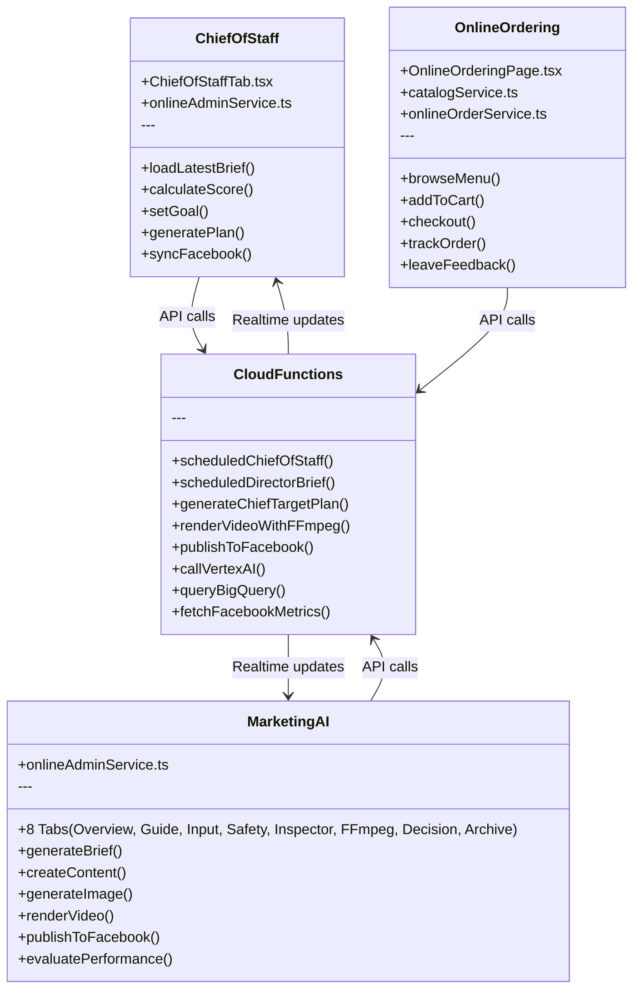

---

## 7. DATABASE SCHEMA

### 7.1 Shared Collections

#### **public_menu**
```javascript
{
  id: "prod_001",
  display_name: "Khô bò",
  sell_price: 50000,
  category: "Món chính",
  imageMode: "ai", // "ai" | "real" | "none"
  image_url: "https://...",
  aiImageUrl: "https://...",
  realImageUrl: "https://...",
  description: "Khô bò tươi ngon...",
  available: true,
  lastSync: Timestamp
}
```

#### **order_requests**
```javascript
{
  id: "req_20260517_001",
  source: "customer_web",
  tableNumber: "5",
  customerName: "Nguyễn Văn A",
  customerPhone: "0901234567",
  items: [
    { productId: "prod_001", quantity: 2, price: 50000 }
  ],
  total: 100000,
  status: "pending_approval", // pending_approval | approved | rejected | completed
  createdAt: Timestamp,
  approvedAt: Timestamp,
  approvedBy: "admin_uid"
}
```

#### **service_requests**
```javascript
{
  id: "service_001",
  tableNumber: "5",
  requestType: "call_staff", // call_staff | request_bill | complaint
  message: "Cần thêm nước",
  status: "pending", // pending | in_progress | resolved
  createdAt: Timestamp,
  resolvedAt: Timestamp
}
```

### 7.2 POS Collections (XEKHO)

#### **Product_Catalog**
```javascript
{
  id: "prod_001",
  name: "Khô bò",
  category: "Món chính",
  sell_price: 50000,
  cost_price: 30000,
  unit: "phần",
  image_url: "https://...",
  recipe: {
    ingredients: [
      { itemId: "ing_001", quantity: 0.2, unit: "kg" }
    ]
  },
  available: true
}
```

#### **Inventory_Items**
```javascript
{
  id: "ing_001",
  name: "Thịt bò",
  category: "Nguyên liệu",
  unit: "kg",
  quantity: 50,
  min_quantity: 10,
  cost_price: 150000,
  supplier: "Nhà cung cấp A",
  lastUpdated: Timestamp
}
```

#### **history**
```javascript
{
  id: "order_20260517_001",
  tableNumber: "5",
  items: [...],
  subtotal: 100000,
  discount: 0,
  total: 100000,
  paymentMethod: "cash",
  status: "completed",
  createdAt: Timestamp,
  completedAt: Timestamp,
  createdBy: "staff_uid"
}
```

### 7.3 Marketing Collections (WEBAPP-MENU)

#### **director_briefs**
```javascript
{
  id: "brief_20260517",
  date: "2026-05-17",
  weather: {
    temp: 27,
    description: "Mưa nhẹ",
    forecast: [...]
  },
  trend: {
    name: "Stand banh mi",
    reason: "Video viral trên TikTok"
  },
  briefText: "Ý tưởng marketing...",
  createdAt: Timestamp,
  sentToTelegram: true
}
```

#### **marketing_actions**
```javascript
{
  id: "action_001",
  briefId: "brief_20260517",
  type: "facebook_post", // facebook_post | facebook_ad | instagram_post
  content: {
    text: "Nội dung bài viết...",
    hashtags: ["#XeKho", "#BanhMi"],
    imageUrl: "https://...",
    videoUrl: "https://..."
  },
  status: "pending_approval", // pending_approval | approved | published | rejected
  publishedAt: Timestamp,
  facebookPostId: "123456789",
  performance: {
    reach: 1000,
    engagement: 50,
    clicks: 20
  },
  grade: "A+", // A+ | A | B | C | D | F
  createdAt: Timestamp
}
```

#### **executive_daily_briefs**
```javascript
{
  id: "chief_20260517",
  date: "2026-05-17",
  score: 85,
  trend: 5, // vs yesterday
  status: "healthy", // healthy | warning | critical
  brief: {
    summary: "Doanh thu tăng 10%...",
    risks: ["Chi phí ads tăng..."],
    wins: ["Publish rate 100%..."],
    recommendations: ["Tăng tần suất post..."]
  },
  metrics: {
    aiAudit: 98,
    readiness: 85,
    decisions: 3,
    workflow: "OK"
  },
  facebook: {
    followers: 1250,
    followersChange: 45,
    engagement: 320,
    engagementChange: -12
  },
  ownerGoal: {
    description: "Tăng 500 like trong tháng 5",
    startDate: "2026-05-01",
    endDate: "2026-05-31",
    chiefPlan: {
      summary: "Phương án...",
      actions: [...]
    }
  },
  createdAt: Timestamp
}
```

---

## 8. API ENDPOINTS

### 8.1 XEKHO Cloud Functions

| Endpoint | Method | Description | Auth |
|----------|--------|-------------|------|
| `/aiRouter` | POST | AI chatbot request handler | Required |
| `/purchaseOcr` | POST | OCR hóa đơn nhập hàng | Required |
| `/telegramWebhook` | POST | Telegram bot webhook | Public |
| `/scheduledReport` | CRON | Báo cáo tự động (*/5 * * * *) | System |
| `/adminGenerateMenuImage` | POST | Tạo ảnh menu bằng Imagen | Required |
| `/adminGenerateMenuDescription` | POST | Tạo mô tả menu bằng Gemini | Required |

### 8.2 WEBAPP-MENU Cloud Functions

| Endpoint | Method | Description | Auth |
|----------|--------|-------------|------|
| `/scheduledChiefOfStaff` | CRON | Chief analysis (0 9 * * *) | System |
| `/chiefOfStaffNow` | POST | Chạy Chief analysis thủ công | Required |
| `/generateChiefTargetPlan` | POST | Tạo phương án từ mục tiêu | Required |
| `/scheduledDirectorBrief` | CRON | Marketing brief (0 9 * * *) | System |
| `/testDirectorBrief` | POST | Test Director brief | Required |
| `/generateMarketingAction` | POST | Tạo content marketing | Required |
| `/renderVideoWithFFmpeg` | POST | Render video | Required |
| `/publishToFacebook` | POST | Publish lên Facebook | Required |
| `/syncFacebookMetrics` | POST | Sync Facebook metrics | Required |

### 8.3 Request/Response Examples

#### **POST /aiRouter**
```javascript
// Request
{
  "message": "Thêm 2 phần khô bò vào bàn 5",
  "userId": "user_123",
  "sessionId": "session_456"
}

// Response
{
  "success": true,
  "response": "Đã thêm 2 phần khô bò vào bàn 5. Tổng tiền: 100,000đ",
  "action": "add_to_order",
  "data": {
    "tableNumber": "5",
    "items": [...]
  }
}
```

#### **POST /generateChiefTargetPlan**
```javascript
// Request
{
  "goalDescription": "Tăng 500 like fanpage trong tháng 5",
  "startDate": "2026-05-01",
  "endDate": "2026-05-31"
}

// Response
{
  "success": true,
  "plan": {
    "summary": "Tăng 500 like = 17 like/ngày...",
    "promptForMarketing": "Tập trung hook mạnh...",
    "actions": [
      "Post 2 bài/ngày vào khung 12h và 18h",
      "Chạy ads 200k/ngày targeting local 5km"
    ],
    "expectedOutcome": "Đạt 500 like sau 30 ngày"
  }
}
```

---

## 9. EXTERNAL SERVICES

### 9.1 Vertex AI (Google Cloud)

#### **Gemini 2.5 Pro**
- **Use cases**: Complex reasoning, long context
- **XEKHO**: AI Chatbot (function calling)
- **WEBAPP-MENU**: Director Brief, Chief analysis
- **Cost**: $7/1M input tokens, $21/1M output tokens

#### **Gemini 2.5 Flash**
- **Use cases**: Fast responses, simple tasks
- **XEKHO**: Quick AI responses
- **WEBAPP-MENU**: Content generation, evaluations
- **Cost**: $0.075/1M input tokens, $0.30/1M output tokens

#### **Imagen 4.0**
- **Use cases**: Image generation from text
- **XEKHO**: Menu images
- **WEBAPP-MENU**: Marketing images
- **Cost**: $0.04/image

### 9.2 Facebook Graph API

#### **Endpoints Used:**
- `GET /{page-id}?fields=followers_count,fan_count,engagement`
- `POST /{page-id}/feed` (Create post)
- `POST /{page-id}/photos` (Upload photo)
- `GET /{post-id}/insights` (Get post metrics)
- `POST /act_{ad-account-id}/campaigns` (Create ad campaign)

#### **Permissions Required:**
- `pages_read_engagement`
- `pages_manage_posts`
- `pages_read_user_content`
- `ads_management`

### 9.3 OpenWeatherMap API

#### **Endpoints Used:**
- `GET /data/2.5/weather?q=Bao Loc&appid={key}` (Current weather)
- `GET /data/2.5/forecast?q=Bao Loc&appid={key}` (5-day forecast)

#### **Data Retrieved:**
- Temperature, humidity, wind speed
- Weather description (rain, clouds, clear)
- Hourly forecast (8 time slots)

### 9.4 BigQuery

#### **Datasets:**
- `pos-v2-909ff.analytics`
  - `daily_kpi` - KPIs hàng ngày
  - `marketing_posts` - Bài viết marketing
  - `orders` - Đơn hàng
  - `customer_behavior` - Hành vi khách hàng

#### **Queries:**
```sql
-- Daily revenue trend
SELECT date, SUM(total) as revenue
FROM `pos-v2-909ff.analytics.orders`
WHERE date >= DATE_SUB(CURRENT_DATE(), INTERVAL 7 DAY)
GROUP BY date
ORDER BY date;

-- Top products
SELECT product_name, SUM(quantity) as total_sold
FROM `pos-v2-909ff.analytics.orders`
WHERE date >= DATE_SUB(CURRENT_DATE(), INTERVAL 30 DAY)
GROUP BY product_name
ORDER BY total_sold DESC
LIMIT 10;
```

### 9.5 Telegram Bot API

#### **Bot Info:**
- **Bot Name**: Xe Khô Kitchen Bot
- **Commands**:
  - `/start` - Khởi động bot
  - `/status` - Xem trạng thái hệ thống
  - `/report` - Xem báo cáo ngày

#### **Notifications:**
- Kitchen orders (realtime)
- Daily reports (9:00 AM)
- Director briefs (9:00 AM)
- Alerts (errors, low inventory)

### 9.6 FFmpeg

#### **Use Cases:**
- Video rendering từ images + audio
- Video transcoding (MP4, WebM)
- Thumbnail generation

#### **Commands:**
```bash
# Render video from images
ffmpeg -framerate 1/3 -i image%d.jpg -i audio.mp3 \
  -c:v libx264 -c:a aac -shortest output.mp4

# Generate thumbnail
ffmpeg -i video.mp4 -ss 00:00:01 -vframes 1 thumbnail.jpg
```

---

## 10. DEPLOYMENT ARCHITECTURE

### 10.1 Firebase Hosting

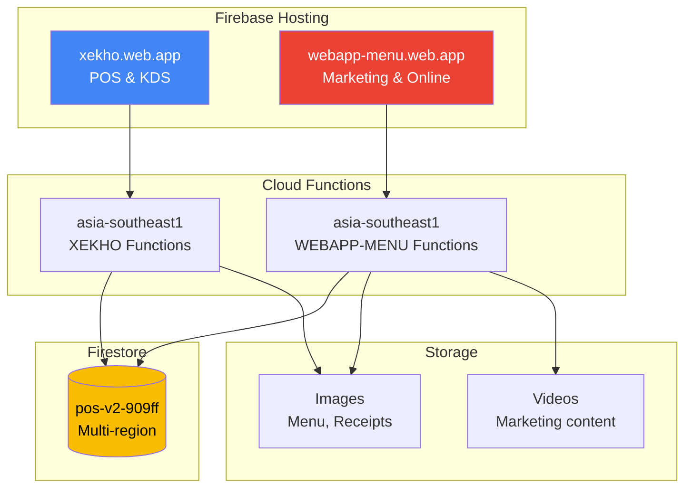

### 10.2 Environment Configuration

#### **XEKHO (.env)**
```bash
FIREBASE_PROJECT_ID=pos-v2-909ff
FIREBASE_REGION=asia-southeast1
VERTEX_AI_PROJECT=pos-v2-909ff
VERTEX_AI_LOCATION=us-central1
TELEGRAM_BOT_TOKEN=***
WEATHER_API_KEY=***
```

#### **WEBAPP-MENU (.env)**
```bash
VITE_FIREBASE_PROJECT_ID=pos-v2-909ff
VITE_FIREBASE_REGION=asia-southeast1
VITE_FACEBOOK_APP_ID=***
VITE_FACEBOOK_PAGE_ID=***
VITE_BIGQUERY_DATASET=analytics
```

### 10.3 Deployment Commands

```bash
# Deploy XEKHO
cd xekho
firebase deploy --only hosting,functions

# Deploy WEBAPP-MENU
cd webapp-menu
npm run build
firebase deploy --only hosting,functions

# Deploy specific function
firebase deploy --only functions:scheduledChiefOfStaff
```

### 10.4 Monitoring & Logging

#### **Firebase Console:**
- Functions logs: Real-time logs, errors
- Firestore usage: Reads, writes, deletes
- Hosting metrics: Bandwidth, requests
- Auth metrics: Sign-ins, users

#### **Google Cloud Console:**
- Vertex AI usage: API calls, tokens
- BigQuery usage: Queries, storage
- Error Reporting: Crash reports
- Cloud Monitoring: Alerts, dashboards

---

## 📚 RELATED DOCUMENTS

- [ROADMAP.md](./ROADMAP.md) - Development roadmap (78% → 100%)
- [IMPLEMENTATION.md](./IMPLEMENTATION.md) - Technical implementation details
- [CHIEF_OF_STAFF_FULL_IMPLEMENTATION_PLAN.md](./CHIEF_OF_STAFF_FULL_IMPLEMENTATION_PLAN.md) - Chief of Staff detailed plan
- [TELEGRAM_REPORT_SETUP.md](./TELEGRAM_REPORT_SETUP.md) - Telegram bot setup guide
- [DEPLOYMENT_GUIDE.md](./DEPLOYMENT_GUIDE.md) - Deployment instructions
- [TESTING_CHECKLIST.md](./TESTING_CHECKLIST.md) - Testing checklist

---

## 🎯 KEY TAKEAWAYS

### **Strengths:**
- ✅ Serverless architecture (auto-scaling, cost-effective)
- ✅ Realtime updates (Firestore listeners)
- ✅ AI-powered (Gemini, Imagen)
- ✅ Multi-platform (POS, KDS, Web, Mobile)
- ✅ Comprehensive (POS + Marketing + Analytics)

### **Areas for Improvement:**
- ⏳ Testing coverage (currently 0%, target 80%)
- ⏳ Mobile UI polish (Marketing AI Tab)
- ⏳ Performance optimization (load time < 2s)
- ⏳ Security audit (rate limiting, input validation)

### **Next Steps:**
1. Complete ROADMAP Phase 1 (Quick Wins)
2. Implement missing features (Facebook Sync, Weather API)
3. Write unit tests & E2E tests
4. Optimize performance & costs
5. Production deployment

---

**Last Updated:** 17/05/2026  
**Maintained By:** Development Team  
**Status:** 🟢 Active & In Production
